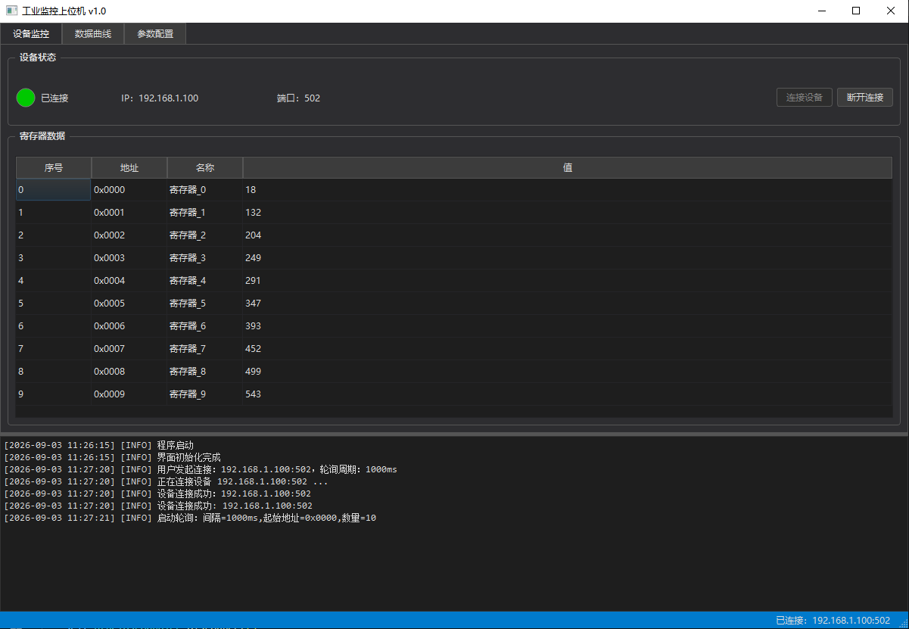
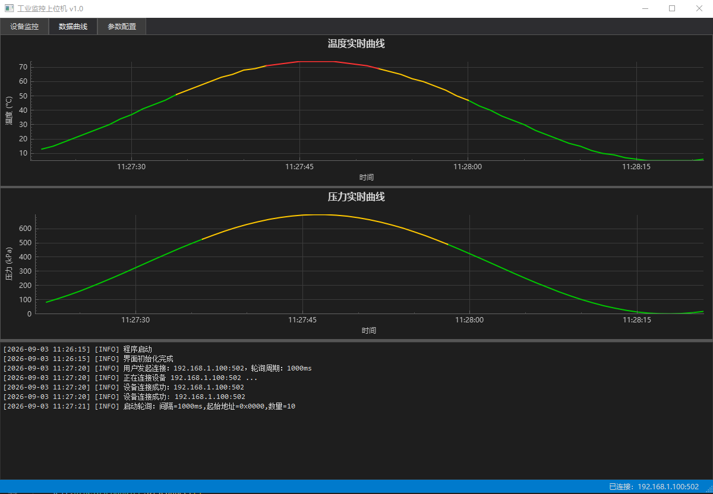

# Qt6 工控上位机综合监控系统

基于 Qt6 + C++17 + CMake 开发的工控上位机 Demo，支持 Modbus-TCP 设备通信、实时数据曲线、断线自动重连等功能。

## 运行环境

- Windows 10 / 11
- 配合 Modbus Slave 模拟器测试（下载地址：https://www.modbustools.com/download.html）

## 快速开始

1. 从 Releases 页面下载最新版 zip
2. 解压后双击 `Qt6_IndustrialMonitorDemo.exe` 运行
3. 打开 Modbus Slave，配置 Connection - Modbus TCP/IP - 端口 502
4. 在上位机的设备监控页点击"连接设备"

## 功能特性

### 设备监控

- Modbus-TCP 连接管理，支持 IP / 端口 / 轮询周期配置
- 设备状态指示灯（已连接 / 连接中 / 断开 / 异常）
- 保持寄存器实时读取，表格展示寄存器数据

### 实时曲线

- QCustomPlot 绘制温度 / 压力实时曲线
- X 轴时间戳，60 秒滚动窗口
- 分段着色：绿色（正常）、黄色（警告）、红色（危险）
- 支持鼠标拖拽、水平缩放

### 断线重连

- 断线自动重连，最多 3 次，间隔 3 秒
- 重连失败弹窗提示，支持手动重新连接

### 参数配置

- IP 地址、端口、轮询周期配置面板
- QSettings 读写 ini 文件，程序启动自动加载

### 日志系统

- 单例模式，全局可用
- 日志分级（Debug / Info / Warning / Error）
- 双输出：界面深色日志窗口 + 本地日志文件
- 线程安全（QMutex 互斥锁）

## 技术栈

- Qt 6.5：Core / Widgets / Network / SerialBus / PrintSupport
- C++17：类内初始化、constexpr 等
- CMake 3.19+：双层 CMakeLists.txt，QCustomPlot 静态库
- QModbusTcpClient：Qt 内置 Modbus-TCP 客户端
- QCustomPlot：第三方轻量级绘图库，编译为静态库
- QThread + moveToThread：通信层子线程，信号槽跨线程通信

## 项目结构

Qt6_IndustrialMonitorDemo/
├── CMakeLists.txt
├── README.md
├── lib/
│   └── qcustomplot/          # QCustomPlot 静态库
└── src/
    ├── CMakeLists.txt
    ├── main.cpp              # 程序入口
    ├── core/
    │   └── logger            # 日志系统（单例）
    ├── communication/
    │   └── modbusclient      # Modbus 通信（子线程）
    └── ui/
        ├── mainwindow        # 主窗口
        ├── pages/
        │   ├── monitorpage   # 设备监控页
        │   ├── chartpage     # 数据曲线页
        │   └── configpage    # 参数配置页
        └── widgets/
            └── indicatorlight # 自定义指示灯控件

## 编译构建

需要 Qt 6.5+ 和 CMake 3.19+

git clone https://github.com/xqj6666/Qt6_IndustrialMonitorDemo.git
cd Qt6_IndustrialMonitorDemo
mkdir build && cd build
cmake .. -G "MinGW Makefiles"
cmake --build .

## 开发计划

- [x] Modbus-TCP 通信
- [x] 实时数据曲线
- [x] 断线自动重连
- [x] 程序打包部署
- [ ] TCP/Modbus 调试助手（Demo2）
- [ ] 串口通信支持

## License

本项目仅用于学习和求职展示。

## 界面截图

### 设备监控页

### 实时数据曲线
